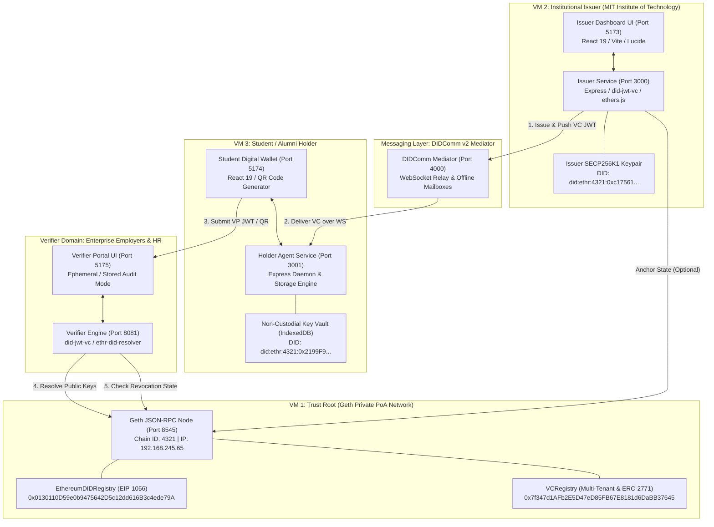

# Master Technical Specification & Implementation Manual
## Decentralized Self-Sovereign Identity (SSI) 3-VM Enterprise Platform

---

## 1. System Topology & Physical Architecture

The platform is designed as an enterprise multi-tenant SSI ecosystem partitioned into three independent cryptographic domains, an asynchronous messaging relay, and an underlying distributed ledger:



---

## 2. Blockchain & Smart Contract Engineering

### A. Private Ethereum Node (Geth)
- **Node Identifier**: Private Proof-of-Authority (PoA) / Proof-of-Work single-node miner.
- **RPC Endpoint**: `http://192.168.245.65:8545` (Subnet: `192.168.245.0/24`).
- **Chain ID**: `4321` (Dedicated identifier to prevent transaction replay on public testnets).
- **APIs Exposed**: `eth`, `net`, `web3`, `personal`, `miner`.
- **CORS & Network Binding**: `--http.addr 0.0.0.0 --http.corsdomain "*"`.

---

### B. Smart Contract 1: `EthereumDIDRegistry.sol` (EIP-1056 Standard)
- **Deployed Address**: `0x0130110D59e0b9475642D5c12dd616B3c4ede79A`
- **Design Objective**: Provides decentralized identity resolution for `did:ethr` without requiring per-identity smart contract deployments (gas-efficient).

#### 1. On-Chain Data Structures
```solidity
mapping(address => address) public owners;
mapping(address => mapping(bytes32 => mapping(address => uint))) public delegates;
mapping(address => uint) public changed;
```

#### 2. Key Methods & Event Logs
- `changeOwner(address identity, address newOwner)`: Changes the controller of an identity. Emits `DIDOwnerChanged(identity, newOwner, previousChange)`.
- `addDelegate(address identity, bytes32 delegateType, address delegate, uint validity)`: Grants signing authority for a specific purpose (e.g., `veriKey`, `sigAuth`) until `block.timestamp + validity`. Emits `DIDDelegateChanged(...)`.
- `setAttribute(address identity, bytes32 name, bytes value, uint validity)`: Publishes public keys, encryption endpoints, or service URLs directly to the identity document via event logs. Emits `DIDAttributeChanged(...)`.

---

### C. Smart Contract 2: `VCRegistry.sol` (Enterprise Multi-Tenant & Revocation)
- **Deployed Address**: `0x7f347d1AFb2E5D47eD85FB67E8181d6DaBB37645`

#### 1. ERC-2771 Gasless Forwarder (Yul Assembly Calldata Slicing)
Enables gasless transactions where university relayers or paymasters submit transactions on behalf of users:
```solidity
function _msgSender() internal view returns (address sender) {
    if (isTrustedForwarder(msg.sender)) {
        // Extracts the 20-byte original signer address appended by Trusted Forwarder at the end of calldata
        assembly {
            sender := shr(96, calldataload(sub(calldatasize(), 20)))
        }
    } else {
        return msg.sender;
    }
}
```

#### 2. Storage Mapping
```solidity
struct VC {
    address issuer;          // 20 bytes (Issuer Ethereum address)
    bytes issuerSignature;   // 65 bytes ECDSA signature
    bool revoked;            // 1 byte revocation flag
    string tenantId;         // e.g., "mit-tech", "stanford-edu"
}
struct HolderSignature {
    address holder;          // 20 bytes (Holder Ethereum address)
    bytes signature;         // 65 bytes ECDSA signature
}
mapping(string => VC) private VCs;
mapping(bytes32 => HolderSignature) private holderSignatures;
```

#### 3. Execution Logic
- `issueVCTenant(string vcId, bytes issuerSignature, string tenantId)`: Registers a VC identifier bound to the caller's address (`_msgSender()`).
- `revokeVC(string vcId)`: Asserts caller is the original issuer (`require(VCs[vcId].issuer == _msgSender())`) and sets `VCs[vcId].revoked = true`.
- `batchVerify(string[] vcIds)`: Returns parallel arrays of `bool[] results` (existence) and `bool[] revocations` in a single RPC roundtrip.

---

## 3. Cryptographic Formulations & Proof Mathematics

### A. Key Derivation & DID Mapping
All actors generate elliptic curve keypairs on `secp256k1` defined by:
$$y^2 = x^3 + 7 \pmod p$$
where $p = 2^{256} - 2^{32} - 977$.

1. **Private Key**: $d \in [1, n-1]$ (256-bit random integer).
2. **Public Key**: $Q = d \times G = (Q_x, Q_y)$ where $G$ is the generator point.
3. **Ethereum Address**:
   $$\text{Address} = \text{last20Bytes}(\text{Keccak256}(Q_x \mathbin{\Vert} Q_y))$$
4. **Decentralized Identifier (DID)**:
   $$\text{DID} = \text{did:ethr:4321:0x} + \text{HexEncode}(\text{Address})$$

---

### B. Mathematical Verification of Credentials (Zero Knowledge of Private Keys)

When a Verifier validates a Verifiable Credential and Presentation, it executes three distinct mathematical checks:

#### Proof 1: Issuer Authenticity (Non-repudiation)
1. Hash the VC message header and payload:
   $$e_{\text{issuer}} = \text{SHA-256}(\text{Base64URL}(\text{Header}) \mathbin{\Vert} \text{"."} \mathbin{\Vert} \text{Base64URL}(\text{Payload}))$$
2. Recover the public key point $Q_{\text{recovered}}$ from the signature $\sigma_{\text{vc}} = (r, s, v)$:
   $$Q_{\text{recovered}} = r^{-1} (sR - e_{\text{issuer}} G)$$
3. Compute the derived Ethereum address:
   $$A_{\text{recovered}} = \text{last20Bytes}(\text{Keccak256}(Q_{\text{recovered}}))$$
4. Assert:
   $$A_{\text{recovered}} \equiv \text{Address}(\text{VC.iss})$$

#### Proof 2: Holder Cryptographic Binding (Anti-Theft Proof)
1. Hash the Verifiable Presentation envelope:
   $$e_{\text{holder}} = \text{SHA-256}(\text{Base64URL}(\text{VP}_{\text{Header}}) \mathbin{\Vert} \text{"."} \mathbin{\Vert} \text{Base64URL}(\text{VP}_{\text{Payload}}))$$
2. Recover holder public key $Q_{\text{holder}}$ from signature $\sigma_{\text{vp}} = (r_{\text{vp}}, s_{\text{vp}}, v_{\text{vp}})$.
3. Assert:
   $$\text{last20Bytes}(\text{Keccak256}(Q_{\text{holder}})) \equiv \text{Address}(\text{VP.iss}) \equiv \text{Address}(\text{VC.sub})$$

#### Proof 3: Document Pre-Image Integrity
The VC embeds the SHA-256 hash of the university's PDF degree certificate:
$$\text{SHA-256}(\text{BinaryBuffer}(\text{DegreeCertificate.pdf})) \equiv \text{VC.credentialSubject.documentHash}$$

---

## 4. W3C Data Models: VC & VP JWT Specifications

### A. Verifiable Credential (VC) JWT Structure
```json
{
  "header": {
    "alg": "ES256K",
    "typ": "JWT"
  },
  "payload": {
    "iss": "did:ethr:4321:0xc17561bfdf4ef0eb4dc749595b3367c246ac31efbdec11ea799874faf8a25843",
    "sub": "did:ethr:4321:0x2199F989d38c64C5632f0590a98D65b71948F894",
    "iat": 1773090000,
    "nbf": 1773090000,
    "jti": "vc_9a8b7c6d5e4f3a2b",
    "vc": {
      "@context": [
        "https://www.w3.org/2018/credentials/v1"
      ],
      "type": [
        "VerifiableCredential",
        "AcademicDegreeCredential"
      ],
      "credentialSubject": {
        "studentId": "2026-CS-001",
        "studentName": "Aarav Sharma",
        "studentEmail": "aarav.sharma@mit.edu",
        "degreeName": "Bachelor of Science in Computer Science & AI",
        "major": "Computer Science & AI",
        "gpa": "3.95 / 4.0",
        "graduationYear": "2026",
        "institutionName": "MIT Institute of Technology",
        "documentHash": "a6c5f789d33b4998e3b0c44298fc1c149afbf4c8996fb92427ae41e4649b934c",
        "hashAlgorithm": "SHA-256"
      }
    }
  }
}
```

---

### B. Verifiable Presentation (VP) JWT Structure
```json
{
  "header": {
    "alg": "ES256K",
    "typ": "JWT"
  },
  "payload": {
    "iss": "did:ethr:4321:0x2199F989d38c64C5632f0590a98D65b71948F894",
    "aud": "did:ethr:4321:0xVerifierAddress",
    "nonce": "e9b7a421-5c8f-4d3b-9a1c-8e4d2f0a6b1c",
    "iat": 1773090050,
    "vp": {
      "@context": [
        "https://www.w3.org/2018/credentials/v1"
      ],
      "type": [
        "VerifiablePresentation"
      ],
      "verifiableCredential": [
        "eyJhbGciOiJFUzI1NksiLCJ0eXAiOiJKV1QifQ.eyJpc3MiOiJkaWQ6ZXRoci...<Compact_VC_JWT>"
      ]
    }
  }
}
```

---

## 5. DIDComm v2 Asynchronous Messaging Protocol

- **Implementation**: `didcomm-mediator/app.js` (Port 4000)
- **Protocol**: Decentralized Identity Communication v2 over WebSockets and HTTP.

### Message Routing Workflow:
1. **Client Subscription**:
   The Holder wallet opens a persistent WebSocket connection:
   ```json
   { "type": "subscribe", "did": "did:ethr:4321:0x2199F989d38c64C5632f0590a98D65b71948F894" }
   ```
   The mediator registers the socket in `connections.set(did, ws)`.

2. **Asynchronous Dispatch**:
   When the Issuer issues a credential, it sends an HTTP POST:
   ```http
   POST /send HTTP/1.1
   Host: localhost:4000
   X-Recipient-DID: did:ethr:4321:0x2199F989d38c64C5632f0590a98D65b71948F894
   Content-Type: application/json

   {
     "type": "https://didcomm.org/issue-credential/3.0/issue-credential",
     "body": { "vcJwt": "<JWT_STRING>" }
   }
   ```

3. **Mailbox Queuing & Delivery**:
   - **Online**: Forwarded immediately across the open WebSocket stream.
   - **Offline**: Appended to `mailboxes.get(did)`. As soon as the Holder reconnects, all pending messages are flushed and acknowledged.

---

## 6. Microservices Source Code Architecture

| Service | Port | Key Code File | Primary Responsibilities |
| :--- | :---: | :--- | :--- |
| **`didcomm-mediator`** | `4000` | `app.js` | WebSocket server, mailbox queue, recipient DID routing. |
| **`issuer-service`** | `3000` | `app.js`, `lib/vc.js` | Express API, `did-jwt-vc` issuance, student database connector, SHA-256 PDF hashing. |
| **`issuer-dashboard`** | `5173` | `src/App.jsx` | React 19 UI, Multi-tenant student roster (30 profiles), 1-Click batch issuance. |
| **`holder-agent`** | `3001` | `index.js` | Local key agent daemon, credential store. |
| **`holder-wallet`** | `5174` | `src/App.jsx` | React 19 wallet UI, IndexedDB non-custodial storage, VP generation, QR code rendering. |
| **`verifier-agent`** | `8081` | `index.js`, `lib/verify.js` | `POST /api/verify`, `@ethr-did-resolver` on-chain lookups, Ephemeral vs Stored audit modes. |
| **`verifier-wallet`** | `5175` | `src/App.jsx` | Employer verification portal, QR scanner, compliance audit log viewer. |

---

## 7. Security, Privacy & Compliance Guarantees

1. **Zero-Knowledge Principle (No PII On-Chain)**:
   The blockchain ledger stores **zero student names, marks, or personal identity numbers**. Only the Issuer's public key delegation and optional cryptographic hashes are recorded.
2. **Replay Attack Resistance**:
   Every presentation includes a single-use `nonce` and `aud` (Audience DID) chosen by the verifier. A captured presentation token cannot be re-sent to another employer.
3. **Regulatory Compliance**:
   - **EU GDPR Article 17 (Right to be Forgotten)**: Since student PII exists only on the student's personal device and the verifier uses **Ephemeral In-Memory Mode**, no personal data lingers in verifier systems.
   - **India Digital Personal Data Protection (DPDP) Act 2023**: Verifiable Presentations ensure explicit, purpose-limited data sharing by the data principal (the student).
